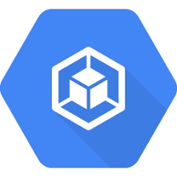
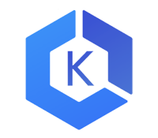

# Portefaix

Kubernetes workshops

## Kubernetes

### GKE

**TODO**

### EKS

**TODO**

### AKS

**TODO**

## Stacks

### Tekton

The Tekton project provides Kubernetes-style resources for declaring CI/CD-style pipelines.

&nbsp;

### Knative

The open source serverless platform built on Kubernetes

&nbsp;

### Kustomize

For the management of Kubernetes resources kustomize is used.

&nbsp;

#### Kaniko

